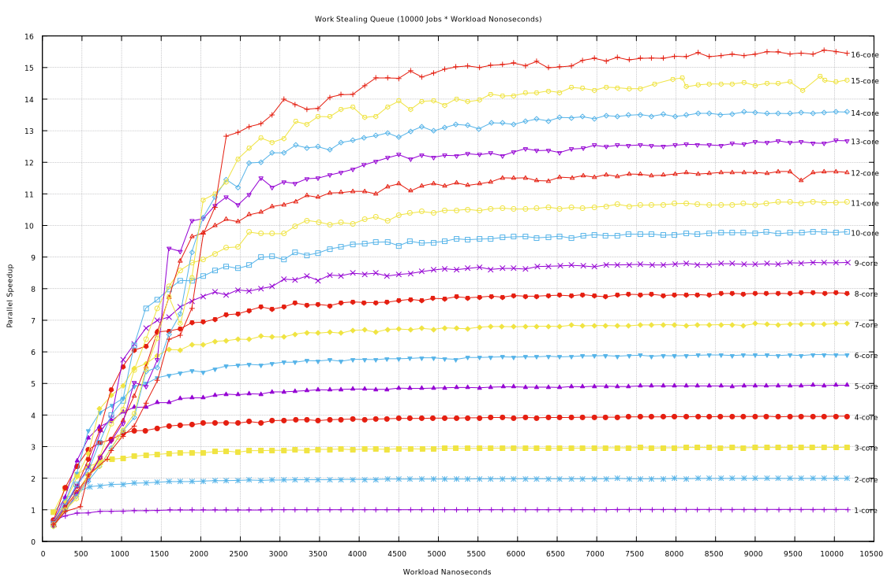

# Work Stealing Queue

This is an implementation of a Work Stealing Queue described in a series of
[blog articles](https://blog.molecular-matters.com) by [Stefan
Reinalter](https://twitter.com/molecularmusing) at Molecular Matters, beginning
with [Job System
2.0](https://blog.molecular-matters.com/2015/08/24/job-system-2-0-lock-free-work-stealing-part-1-basics/).

## Origin

In the blog article, Stefan uses a lock-free structure with memory barriers and
compare-exchange primitives.  This algorithm also uses these ideas, but does so
in a slightly different way then described by Stefan.  It dispenses with the
memory barriers and uses compare-exchange with exchange primitives to schedule
jobs using a [Work Stealing
Queue](https://stackoverflow.com/questions/27830691/work-stealing-and-deques)
which is probably taught in many CS classes like [CSE P 506 -
Concurrency](https://courses.cs.washington.edu/courses/csep506/11sp/Home.html).

## Description of Algorithm

A Work Stealing Queue is a double ended queue that each thread/core maintains.
The thread which owns the queue puts jobs at the bottom end of the queue and
other threads to steal jobs from the top end, when they have nothing to do in
their own queues.

```console
+--------+ <- entries[ 0 ]
|  top   | <- stealers consume here: job = entries[ top++ ]
|        |
|   ||   |
|        |
|   vv   |
| bottom | <- owner pushes here:    entries[ bottom++ ] = job
|        |    owner consumes here:  job = entries[ --bottom ]
|        |
+--------+ <- entries[ MASK_JOBS ]
```

The parallelism obtained by this lock-free structure is fine grained.  The test
included is able to schedule synthetic jobs with approximately 100 ns (per
thread) of overhead on my <b>i9-7960X</b> cpu.  I surmise that most of the this
is due to the cache coherency overhead of the x86 <b>cmpxchg</b> and
<b>xchg</b> instructions along with push/pop mechanics of the queue.

I measure this 100 ns overhead by putting jobs into the queue with only one
worker thread.

```console
$ git clone https://injinj.github.com/WSQ
$ cd WSQ
$ g++ -std=c++11 -O3 -ggdb test_job.cpp -pthread
$ a.out -c 1
Sizeof Job Sys Ctx: 528
Sizeof Job Thread:  524352
Sizeof Job:         56
Sizeof Job Alloc:   65480
Number of threads:  1
Serial workload:    1000 iterations
Parallel workload:  10000 jobs
Workload  Serial Elapsed  Parallel Elapsed  Speedup
--------  --------------  ----------------  -------
     100          143 ns            236 ns     0.61  (- 93 / thr: 93)
     200          288 ns            383 ns     0.75  (- 95 / thr: 95)
     300          432 ns            518 ns     0.83  (- 86 / thr: 86)
     400          578 ns            650 ns     0.89  (- 72 / thr: 72)
     500          721 ns            792 ns     0.91  (- 71 / thr: 71)
     600          870 ns            938 ns     0.93  (- 68 / thr: 68)
^C
$ a.out -c 2                                                            
Sizeof Job Sys Ctx: 528
Sizeof Job Thread:  524352
Sizeof Job:         56
Sizeof Job Alloc:   65480
Number of threads:  2
Serial workload:    1000 iterations
Parallel workload:  10000 jobs
Workload  Serial Elapsed  Parallel Elapsed  Speedup
--------  --------------  ----------------  -------
     100          142 ns            276 ns     0.51  (- 134 / thr: 67)
     200          287 ns            285 ns     1.01
     300          435 ns            345 ns     1.26
     400          579 ns            409 ns     1.42
^C
a.out -c 3
Sizeof Job Sys Ctx: 528
Sizeof Job Thread:  524352
Sizeof Job:         56
Sizeof Job Alloc:   65480
Number of threads:  3
Serial workload:    1000 iterations
Parallel workload:  10000 jobs
Workload  Serial Elapsed  Parallel Elapsed  Speedup
--------  --------------  ----------------  -------
     100          144 ns            473 ns     0.30  (- 329 / thr: 109)
     200          287 ns            375 ns     0.77  (- 88 / thr: 29)
     300          432 ns            335 ns     1.29
```

I also created a gnuplot script to graph the speedup of this synthetic
workload.  This graph is the result of running that.

```console
$ gnuplot
Terminal type set to 'qt'
gnuplot> load "plot.gnuplot"
1-core
2-core
3-core
4-core
5-core
6-core
7-core
8-core
9-core
10-core
11-core
12-core
13-core
14-core
15-core
16-core
```



I believe that a lower overhead W.S. Queue may be obtained by the ability to
schedule many jobs in one call rather than one job at a time, but first, I
would like some other workload beyond this synthetic one for a more real world
scenario.  Maybe a sorting, a compression, or an indexing workload.

